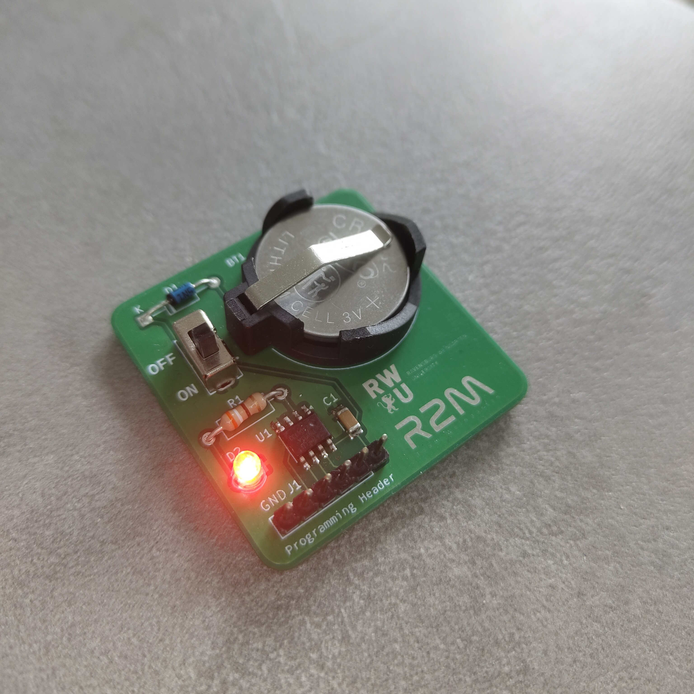

# Open Source project to get familiar with the basics of soldering, electronics and programming.

This compact 4cm*4cm PCB, powered by a coin cell and driven by an ATtiny13A microcontroller, is designed to make learning electronics engaging and accessible. With a single blinking LED, clearly labeled components, and Arduino IDE compatibility via programming headers, it offers a hands-on introduction to soldering, microcontrollers, and embedded programming. Originally developed for university workshops, its minimalist design and modular approach make it perfect for classrooms, makerspaces, and self-guided learners alike. At a low cost of around 1.5€ per unit, it's affordable enough for every participant to take home, encouraging continued exploration and tinkering beyond the workshop.

#### This is how an assembled v1 board looks like:

